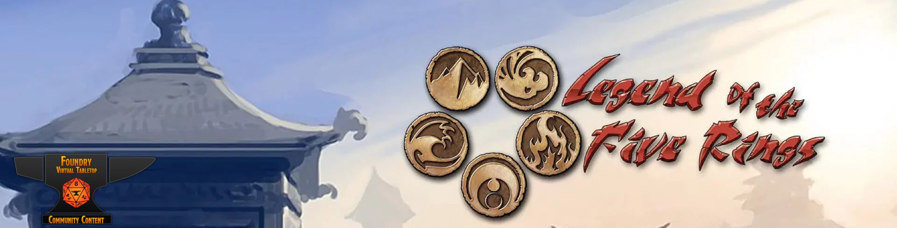

# Legend of the Five Rings 4th Edition for Foundry VTT



[](https://foundryvtt.com/)
[](https://github.com/ernieayala/l5r4/releases)
[](https://github.com/ernieayala/l5r4/blob/main/COPYING)
[](https://github.com/ernieayala/l5r4/issues)

An unofficial, comprehensive implementation of the Legend of the Five Rings 4th Edition tabletop RPG for Foundry VTT. Experience the world of Rokugan with complete character management, authentic dice mechanics, and full L5R4e rule support.

## ✨ What's New in v1.0.0

This major release features a complete system overhaul with:
- **Foundry v13 Compatibility**: Built on the latest Foundry architecture
- **Enhanced Performance**: Streamlined code organization and improved maintainability  
- **Seamless Migration**: Automatic upgrade from previous versions with data preservation

## Core Features

### Character Management
- **Complete PC Sheets**: Full character sheets with all L5R4e attributes, skills, advantages, disadvantages, and equipment
- **NPC Sheets**: Streamlined sheets for NPCs with essential stats and rollable attacks
- **Automatic Calculations**: Derived attributes (Initiative, Armor TN, Rings, Wound Levels) calculated automatically
- **Insight Rank Tracking**: Automatic insight rank calculation based on total insight points
- **Wound System**: Dynamic wound level tracking with penalties applied automatically

### 🎲 Authentic L5R Dice System
- **Roll & Keep Mechanics**: Full implementation of the iconic XkY system
- **Ten Dice Rule**: Automatic enforcement with Little Truths variant support
- **Exploding Dice**: Configurable explosion thresholds for weapons and techniques
- **Emphasis Support**: Reroll 1s on first roll for emphasized skills
- **Unskilled Rolls**: Ctrl+click rings for unskilled rolls (especially useful for Void)
- **Raises**: Declare raises before rolling for enhanced effects (+5 TN each)
- **Void Points**: Spend Void for +1k1 bonus to rolls

### ⚔️ Combat & Equipment
- **Weapon Integration**: Rollable weapons with damage calculations and special properties
- **Armor System**: Automatic TN calculations with proper stacking rules
- **Stance Management**: Mutually exclusive stance status effects
- **Initiative System**: Automated initiative tracking with proper modifiers

### 🔮 Spellcasting System
- **Ring-Based Magic**: Complete spell system with automatic TN calculations
- **Maho Support**: Toggle for maho spells with appropriate warnings and effects
- **Multi-Ring Spells**: Support for spells usable with multiple rings
- **Raise Effects**: Spell-specific raise options for enhanced casting

## 🎯 Integrated Dice Roller

Built-in L5R4e dice parser that seamlessly converts chat messages into authentic Foundry rolls with beautiful L5R styling.

### Quick Syntax Guide
| Roll Type | Syntax | Example | Description |
|-----------|--------|---------|-------------|
| Standard | `XkY` | `5k3` | Roll 5 dice, keep 3 highest |
| Custom Explosion | `XkYxZ` | `5k3x9` | Explode on 9+ instead of 10 |
| Unskilled | `uXkY` | `u4k2` | No exploding dice |
| Emphasis | `eXkY` | `e5k3` | Reroll 1s once |
| With Modifier | `XkY±A` | `5k3+2` | Add/subtract bonus |

### Foundry Integration
Works seamlessly with all Foundry roll commands:
- `/roll 6k4` - Public roll
- `/gmroll 6k4` - GM-only roll  
- `/selfroll 6k4` - Private roll
- `/blindroll 6k4` - Hidden roll
- `[[6k4]]` - Inline rolls in chat or journals

### Visual Experience
- 🎨 Custom L5R4e-themed roll cards
- ✨ Exploding dice animations and effects
- 📊 Clear success/failure indicators
- 🎯 Automatic raise tracking and TN display

## 🚀 Installation

### Method 1: Foundry System Browser (Recommended)
1. Launch Foundry VTT
2. Navigate to **Game Systems** tab
3. Click **Install System**
4. Search for **"Legend of the Five Rings 4th Edition"**
5. Click **Install**

### Method 2: Manual Installation
Use this manifest URL in Foundry's system installer:
```
https://github.com/ernieayala/l5r4/releases/latest/download/system.json
```

### Method 3: Development Installation
Clone the repository directly to your Foundry systems directory:
```bash
cd [foundry-data-path]/systems/
git clone https://github.com/ernieayala/l5r4.git
```

## 🌍 Localization

Full internationalization support with complete translations:
- 🇺🇸 **English** (en)
- 🇪🇸 **Español** (es) 
- 🇫🇷 **Français** (fr)
- 🇧🇷 **Português (Brasil)** (pt-BR)

*Community translations welcome! Submit pull requests on [GitHub](https://github.com/ernieayala/l5r4).*

## ⚙️ System Requirements

- **Foundry VTT**: v13.x or later
- **Architecture**: Modern Foundry v13 ActorSheetV2/ItemSheetV2 framework
- **Migration**: Automatic world data migration from previous versions

## 🔧 Recommended Modules

### Essential Companions
- **[Dice So Nice!](https://foundryvtt.com/packages/dice-so-nice)** - Beautiful 3D dice animations that work perfectly with L5R rolls
- **[Token Action HUD](https://foundryvtt.com/packages/token-action-hud)** - Quick access to character actions and rolls

### Quality of Life Enhancements  
- **[Drag Ruler](https://foundryvtt.com/packages/drag-ruler)** - Enhanced movement measurement
- **[Combat Utility Belt](https://foundryvtt.com/packages/combat-utility-belt)** - Advanced combat management tools
- **[Monk's Enhanced Journal](https://foundryvtt.com/packages/monks-enhanced-journal)** - Better organization for campaign notes

## 🔄 Migration & Upgrading

### From Previous Versions
- ✅ **Automatic Migration**: World data seamlessly upgraded on first load
- 💾 **Backup Recommended**: Always backup your world before major updates  
- 🛑 **Safety Controls**: Migration can be disabled in system settings if needed
- 🔒 **Data Preservation**: Existing characters and items remain fully functional

## 🛠️ Development & Contributing

### Project Architecture
```
module/
├── documents/     # Actor/Item classes with game rule logic
├── sheets/        # UI rendering with ActorSheetV2/ItemSheetV2  
├── services/      # Dice mechanics, chat rendering, utilities
└── setup/         # Settings, templates, migrations
```

### How to Contribute
We welcome contributions! Here's how to get started:

1. **Fork** the repository on [GitHub](https://github.com/ernieayala/l5r4)
2. **Clone** your fork locally
3. **Create** a feature branch (`git checkout -b feature/amazing-feature`)
4. **Follow** our code style:
   - JSDoc comments for functions
   - kebab-case for file names
   - PascalCase for class names
5. **Test** thoroughly with existing worlds
6. **Submit** a pull request with a clear description

### 🐛 Bug Reports
Found an issue? Report it on [GitHub Issues](https://github.com/ernieayala/l5r4/issues) with:
- Foundry VTT version
- System version
- Steps to reproduce
- Console errors (press F12 → Console tab)
- Screenshots if applicable

## 📄 License & Attribution

### Code License
This project is licensed under the [GNU General Public License v3.0](https://www.gnu.org/licenses/gpl-3.0.en.html) and complies with the [Foundry Virtual Tabletop EULA](https://foundryvtt.com/article/license/) for system development.

### Assets & Icons
All visual assets are used with proper attribution:
- **Samurai Icons**: [Freepik, shmai, photo3idea_studio, juicy_fish, Flaticon, Handicon, berkahicon, cube29](https://www.flaticon.com/free-icons/samurai)
- **Additional Icons**: [Hey Rabbit from Noun Project (CC BY 3.0)](https://thenounproject.com/browse/icons/term/samurai/)

### Acknowledgments
This system builds upon the foundational work of the original L5R 4th Edition contributors. While significantly refactored and modernized, we acknowledge and appreciate their pioneering efforts in bringing Legend of the Five Rings to Foundry VTT.

### Legal Disclaimer
This is an **unofficial fan-made system**. Legend of the Five Rings is a trademark of Fantasy Flight Games. This system is not affiliated with, endorsed by, or sponsored by Fantasy Flight Games.

---

## 🌸 Experience Rokugan

*"In a land where honor is stronger than steel, your story awaits..."*

Ready to begin your journey in the Emerald Empire? Install the system and let the kami guide your dice! 

**Questions?** Join our community discussions on [GitHub](https://github.com/ernieayala/l5r4/discussions) or report issues on our [issue tracker](https://github.com/ernieayala/l5r4/issues).
